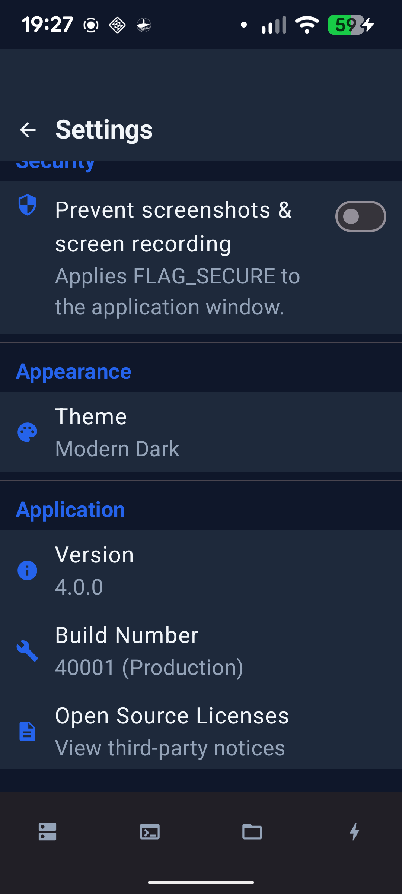
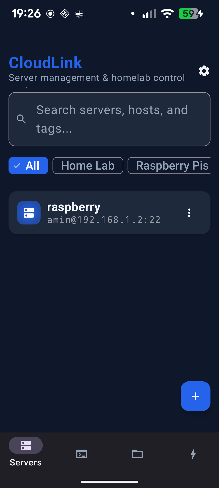
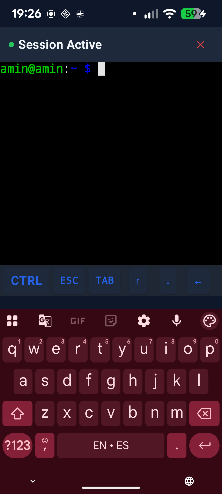
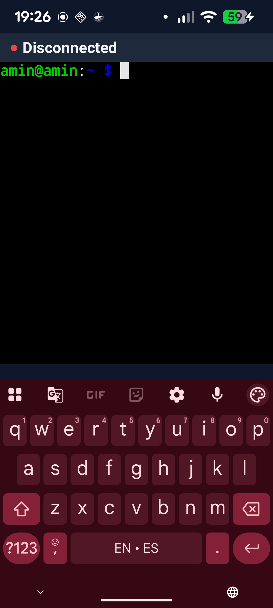
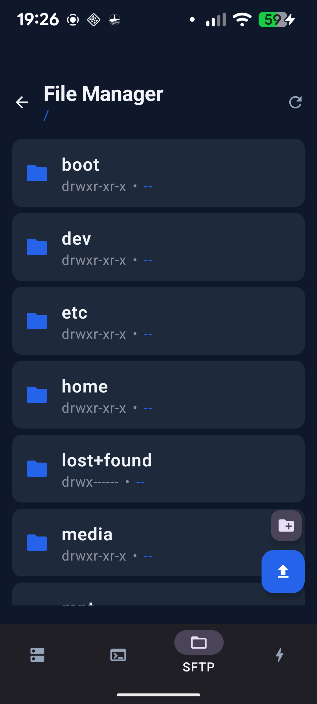

# CloudLink



CloudLink is a native Android application for managing remote Linux servers over SSH and SFTP. It includes a custom Canvas-rendered VT/ANSI terminal, remote text editor, portable best-effort telemetry, and local network tools.

## Overview

CloudLink is built with Jetpack Compose, coroutines, Hilt, Room, Android Keystore-backed credential encryption, and the maintained mwiede JSch fork. It is local-first and contains no analytics or advertising SDK. See the documented limitations before relying on it for critical infrastructure.

## Screenshots

| Dashboard | Terminal |
| :---: | :---: |
|  |  |
| **SFTP File Manager** | **Network Tools** |
|  |  |

*(See `docs/screenshots/` for additional full-resolution images.)*

## Architecture

CloudLink uses an MVVM-shaped, state-flow architecture:

- **UI Layer**: Built entirely in Jetpack Compose.
- **State Management**: Kotlin Coroutines & StateFlow.
- **Dependency Injection**: Dagger Hilt.
- **Persistence**: Room Database (Server configs, connection logs) & EncryptedSharedPreferences (Credentials).
- **Network Protocol**: JSch (SSH2 implementation in Java).

## Feature Highlights

- **Custom Terminal Engine**: A built-from-scratch Canvas-rendered VT100 emulator with a 10,000-line scrollback buffer and xterm 256-color support.
- **Robust SSH Management**: Password and RSA private key authentication.
- **Integrated SFTP**: A full file manager to browse, edit, and transfer files remotely.
- **Network Utilities**: Built-in Ping, Wake-on-LAN, and RSA Key Generation.
- **Credential Security**: AES-256-GCM credential encryption with a master key held by Android Keystore, plus an application lock supporting a strong biometric or device screen-lock credential.
- **Dynamic Themes**: Fully customizable dark/light material themes.

For a code-verified capability summary, see [FEATURES.md](FEATURES.md). Terminal, key, SFTP, telemetry, and release boundaries are explicit in [Known Limitations](docs/KNOWN_LIMITATIONS.md).

## Installation & Build Instructions

### Prerequisites
- Android Studio Ladybug (or newer)
- JDK 17 (set via `JAVA_HOME`)
- Android SDK API Level 36

### Building from Source

1. Open the repository in Android Studio and sync Gradle.

2. Build and verify:
   ```bash
   ./gradlew testDebugUnitTest lint assembleDebug assembleRelease
   ```

Without release-signing environment variables, `assembleRelease` deliberately produces an unsigned minified APK. See [Release Checklist](docs/RELEASE_CHECKLIST.md).

## Project Structure

```
CloudLink/
├── app/
│   ├── src/main/java/com/cloudlink/app/
│   │   ├── data/       # Repositories, JSch Networking, Database, Security
│   │   ├── di/         # Dagger Hilt Modules
│   │   ├── domain/     # Repository Interfaces
│   │   ├── terminal/   # Custom VT100 Emulator, Buffer, & Cell Engine
│   │   └── ui/         # Compose screens, themes, navigation, ViewModels
├── build.gradle.kts
└── settings.gradle.kts
```

## Security Overview

Security is a primary focus of CloudLink. Server credentials are encrypted at rest using `EncryptedSharedPreferences` with AES256-GCM and a master key held by Android Keystore. Hardware-backed key storage depends on device capabilities. Encrypted credentials and SSH host-trust data are explicitly excluded from Android backup and device transfer.

For the threat model and responsible disclosure, read [Security Model](docs/SECURITY_MODEL.md) and [SECURITY.md](SECURITY.md).

## Support & Documentation

- [Feature Reference](FEATURES.md)
- [Changelog](CHANGELOG.md)
- [Frequently Asked Questions (FAQ)](FAQ.md)
- [Future Roadmap](ROADMAP.md)
- [Architecture](docs/ARCHITECTURE.md)
- [Testing](docs/TESTING.md)
- [Release Checklist](docs/RELEASE_CHECKLIST.md)
- [Dependency Review](docs/DEPENDENCIES.md)
- [Hardening Report](docs/CODEX_FINAL_REPORT.md)

## Contributing

We welcome contributions from the community! Please read our [Contributing Guidelines](CONTRIBUTING.md) and our [Code of Conduct](CODE_OF_CONDUCT.md) before submitting Pull Requests.

## Acknowledgements & Credits

See [CREDITS.md](CREDITS.md) for a full list of open-source libraries and contributors that made CloudLink possible.

## License

This project is licensed under the terms outlined in the repository. See [NOTICE](NOTICE) for third-party licenses.

## Contact

Mohamed Amine Aslimani<br>
Founder and Developer — CloudLink / Zxeon Tech<br>
anaslimani923@gmail.com
